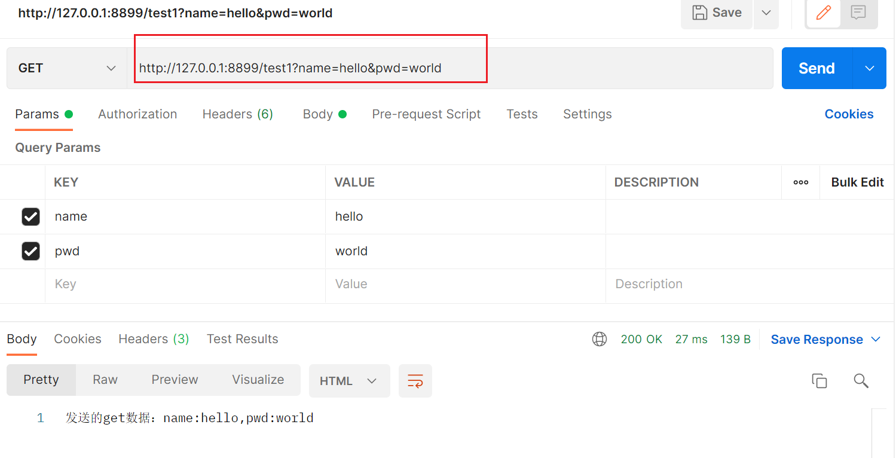
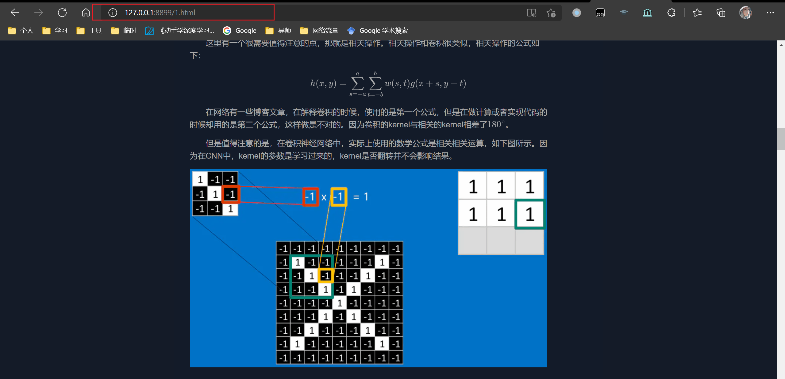
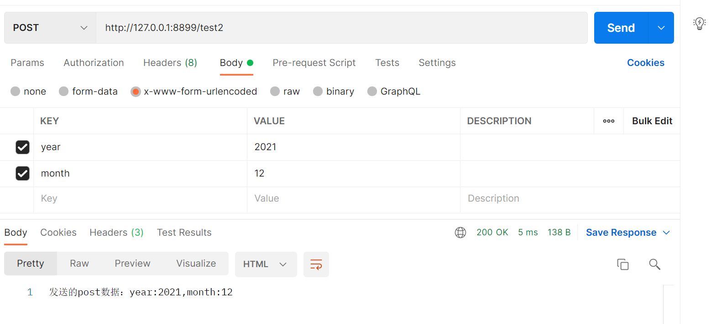
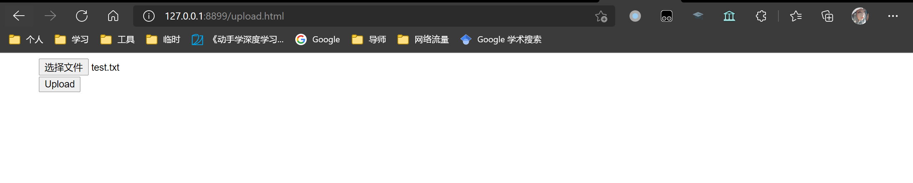

# Http Sever 

使用C语言实现http，运行前请修改config.h文件，更改 RES_DIR ，CA_PATH，和PK_PATH。相关文件已经在项目中，请修改为绝对路径。


## 0 环境及运行说明

1. 运行环境
   - libevent 2.0.20
   - openssl
   - glib：使用其中的hash_table用来保存请求头or请求数据中的key和value
   - cmake
   
2. Server监听并IP发来的请求，端口默认为8899

3. 本程序基本设置可在/include/config.h下进行更改

   > 可配置是否开启https 及 chunk，资源文件位置、证书、私钥位置、chunk_size、MAX_BUF_SIZE。

4. 建议使用火狐浏览器作为Http客户端进行测试

5. main函数：server_libevent.c

   

## 1 基本功能


本组Http server实现了Http协议中的Post/Get方法，可以上传和下载文件
### Get请求结果

  + Postman发送get请求

    server接收到get请求后，返回get请求的参数

    

- 浏览器查看html页面

  

- Wireshark抓包
  请求
  
  响应
  

### Post请求结果

- Postman发送post请求
  
  server接收到post请求后，返回post请求的参数结果。（目前post只支持x-www-form-urlencoded）
  
  
  
  

### 文件上传

文件上传后，将文件保存在`RES_DIR`目录中，然后可以通过http进行访问（文件名是上传时候的文件名）。文件上传只支持`multipart/form-data`的方式。



文件上传成功后会返回如下信息。


上传后，可以按照上传的文件名进行访问。


## 2 分块传输

分块大小设置为256（config.h文件中进行开启和配置），使用postman发送get请求，获取分块的响应。

- wireshark抓包结果如下所示

请求

响应


## 3 Https

使用火狐浏览器测试Https，服务端正确响应

使用wireshark抓取TLS包


## 4 Libevent并发

编写脚本进行并发测试，设置200个线程，具体代码如下
```python
import requests
import threading

THREADING_NUM = 200
def Run():
    req = requests
    res = req.get("http://127.0.0.1:8899/1.html")
    print(res.status_code,end="")

threads=[threading.Thread(target=Run) for i in range(THREADING_NUM)]

for i in threads:
    i.start()

```

每个线程均收到正确的响应


## 5. 长连接

服务端将response 的 header设置为 `HTTP/1.1`，则浏览器就会使用长连接的方式与浏览器进行数据通信。

# 原理说明

## 1. libevent的处理流程

libevent使用三个回调函数：on_accept，on_read，on_write

- on_accept：接受client的连接
- on_read：接收到client发送过来的数据
- on_write：发送数据给client

```c
// 关于如何使用libevent处理数据

#include <openssl/ssl.h>
#include <openssl/err.h>

struct socket_event
{
    // client 的句柄
    int client_fd;
    // ssl 如果不使用ssl则为null
    SSL *ssl;
    struct event_base *base;
    struct event *read_event;
    struct event *write_event;
    // read函数读取的数据
    char *buf;
};

// on_accept 接收到一个client之后，马上创建一个线程来处理这个client
void on_accept(int server_socket_fd, short event, void *arg);

// 创建一个线程，处理这个client，这个线程会调用thread_process_http这个函数
void create_new_thread(struct socket_event *socket_event);

// thread_process_http函数使用libevent调用on_read函数来read client的数据
void *thread_process_http(void *arg);

// on_read函数监听client数据，然后使用libevent调用on_write函数来write client的数据
void on_read(int client_fd, short event, void *arg);

// 写数据
void on_write(int client_fd, short event, void *arg);

// 处理数据
int deal_data_and_response(struct socket_event *socket_event);
```


## 2. 创建线程

线程处理http请求，每个http请求都会创建一个线程。对于长连接，则不会这样做。长连接是多个请求创建一个fd，则只为该fd创建一个thread。

```c
#ifndef MY_HTTP_THREAD_PROCESS_HTTP_H
#define MY_HTTP_THREAD_PROCESS_HTTP_H
#include "my_socket.h"
/**
 * @brief 线程处理http请求，每个http请求都会创建一个线程
 * 
 * @param client_socket client的套字节
 * @return int 0:成功 -1:失败 
 */
int process_http(struct my_socket *my_socket);
#endif //MY_HTTP_THREAD_PROCESS_HTTP_H

```


## 3. 处理不同的url调用不同的方法

根据不同的URI调用不同的函数。

- res_url_deal：资源文件都调用该函数
- url_test1_deal：处理/test1 请求
- url_test2_deal：处理/test2 请求
- url_upload_deal：处理/load 请求

```c
#ifndef MY_HTTP_DEAL_URL_REQUEST_H
#define MY_HTTP_DEAL_URL_REQUEST_H

#include "response.h"
#include "request.h"
#include "response_util.h"
#include "my_socket.h"

// 请求html 和 图片资源统一的方法。

/// 请求html 和 图片资源统一的方法。
/// @param url_filename 资源请求的url 如：1.html,2.jpg
/// @param response 返回的响应数据结构
/// @param socket client socket
int res_url_deal(char *url_filename, int type, struct http_response *response, struct my_socket *my_socket);

// 处理/test1 请求
int url_test1_deal(int type, struct request_data *request_data, struct http_response *response, struct my_socket *my_socket);

// 处理/test2 请求
int url_test2_deal(int type, struct request_data *request_data, struct http_response *response, struct my_socket *my_socket);

// 处理/load 请求
int url_upload_deal(int type, struct request_data *request_data, struct http_response *response, struct my_socket *my_socket);

#endif //MY_HTTP_DEAL_URL_REQUEST_H

```

## 4. 初始化fd的函数

主要目的是为了创建server or client的套接字。

```c
#include <openssl/ssl.h>
#include <openssl/err.h>

#ifndef MY_HTTP_SSL_SOCKET_H
#define MY_HTTP_SSL_SOCKET_H

// 发送数据所使用的fd。 
struct my_socket
{ 
    SSL *ssl; // https使用
    int client_socket;
};

// 初始化ssl
void ssl_socket_init(SSL_CTX **ctx);
// 创建ssl套接字
void create_ssl(SSL **ssl, SSL_CTX *ctx, int client_socket);
// 初始化server的套接字
int init_socket(int port);

#endif //MY_HTTP_SSL_SOCKET_H

```


## 5. 对post or get请求进行解析的函数

以下函数分别对get请求和post请求的数据进行解析，将header存在hashtable中便于存取。将数据存在body中。

```c
#ifndef MY_HTTP_REQUEST_H
#define MY_HTTP_REQUEST_H

#include "glib.h"
/**
 * @brief http请求的数据结构
 * 
 */
struct http_request
{
    char *method;        //请求方法 get post
    char *url;           // 请求路由
    char *version;       // 请求版本
    GHashTable *headers; // 请求头
    void *body;          // 请求体 get请求没有body
};

/**
 * @brief http请求的数据 real_url为去除/的url，data为请求的数据 key:value or others(上传文件)
 * 
 */
struct request_data
{
    char *real_url;
    GHashTable *data;
};

/// @brief 解析请求的数据，将其解析成http_request的数据结构
/// @param req
/// @param http_data http请求的数据
void parse_request(struct http_request *req, char *http_data);

/// @brief 将http_request中的url数据进行解析，得到get请求中的参数  /get?a=1&b=2
/// @param http_request http请求的数据结构
/// @param request_data 解析后的数据结构 key:value
void parse_get_data(struct http_request *http_request, struct request_data *request_data);

/// @brief 将http_request中的body数据进行解析，得到post请求中body的参数
/// @param http_request http请求的数据结构
/// @param request_data 解析后的数据结构 key:value
void parse_post_data(struct http_request *http_request, struct request_data *request_data);

#endif //MY_HTTP_DEAL_URL_REQUEST_H
```


## 6. 构造response数据结构


```c
#ifndef MY_HTTP_RESPONSE_UTIL_H
#define MY_HTTP_RESPONSE_UTIL_H

#define HTTP_TEXT 1
#define HTTP_IMAGE 2
#define GET_PARAMS_DATA 3

#include "response.h"

/// @brief 解析http请求的数据类型
/// @param url 请求的url，如果url=/***.html 或者 /***.jpg，则认为要打开本地文件进行read，如果为 /***?name=***&age=***，或者***则认为是发送数据
/// @param filename 将 /1.html -> 1.html
/// @param type 请求的类型
int parse_request_type(char *url, char **filename);

/// @brief 为response添加响应头
/// @param type
void build_response_headers(int type, struct http_response *response);

// 构造文件的请求体。
void build_response_file_body(int type, char *filename, struct http_response *response);

#endif //MY_HTTP_RESPONSE_UTIL_H

```


## 7. 发送数据

http和https需要调用不同的write函数，因此分别创建了`send_normal_headers`、`send_normal_response`、`send_ssl_response`、`send_ssl_headers`来进行处理。同时在send的时候，更具chunk的配置来决定发送的方式。

````c
#ifndef MY_HTTP_RESPONSE_H
#define MY_HTTP_RESPONSE_H

#include <glib.h>

#include <openssl/ssl.h>
#include <openssl/err.h>
#include <stdio.h>
#include "my_socket.h"

struct http_response
{
    char *version;
    char *status_code;
    char *reason_phrase;
    GHashTable *headers;
    void *body;
    size_t content_length;
};

// 发送数据,根据配置选择调用 send_normal_response or send_ssl_response
int send_response(struct http_response *response, struct my_socket *my_socket);

// 发送header,根据配置选择调用 send_normal_headers or send_ssl_headers
int send_headers(gpointer key, gpointer value, gpointer stream);

// 发送http header数据
void send_normal_headers(gpointer key, gpointer value, gpointer stream);

// // 发送http header数据
int send_normal_response(struct http_response *response, struct my_socket *my_socket);

// 发送https header数据
int send_ssl_response(struct http_response *response, struct my_socket *my_socket);

// // 发送https header数据
void send_ssl_headers(gpointer key, gpointer value, gpointer stream);
// void send_body(char* body,FILE *stream);

#endif //MY_HTTP_RESPONSE_H

````

### 7.1 chunk的发送方式

根据http协议使用chunk的方式，构造chunk的发送逻辑。

```c
if (CHUNK)
{
    int epoch = response->content_length / CHUNK_SIZE;
    int last = response->content_length % CHUNK_SIZE;
    int i = 0;
    while (i < epoch)
    {
        fprintf(stream, "%x\r\n", CHUNK_SIZE);
        fwrite(response->body + i * CHUNK_SIZE, 1, CHUNK_SIZE, stream);
        fprintf(stream, "\r\n");
        i++;
    }
    fprintf(stream, "%x\r\n", last);
    fwrite(response->body + epoch * CHUNK_SIZE, 1, last, stream);
    fprintf(stream, "\r\n");
    fprintf(stream, "%x\r\n", 0);
    fprintf(stream, "\r\n");
}
```

# 存在的问题

1. 代码较为冗余，不够模块化
2. ssl_write的chunk并发存在一些问题
3. 没有对一些header 或者请求方式做校验
3. 对于异常情况没有做处理

